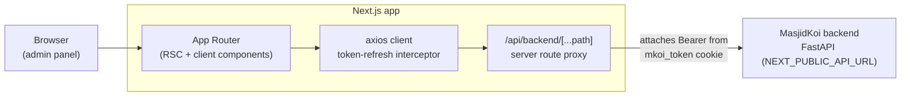

# MasjidKoi Web Admin

Next.js web admin panel for **MasjidKoi** — a masjid discovery, prayer-times,
community, and donation platform for Bangladesh. It is the operator UI over the
[MasjidKoi backend](../backend) FastAPI service, serving three audiences:

- **Platform admins** — moderate masjids, users, reports, donations, and settings
- **Masjid admins / co-admins** — manage a masjid's profile, prayer times,
  announcements, events, campaigns, photos, and reviews
- **Public** — browse masjids and their public pages

---

## Stack

| Concern | Technology |
|---|---|
| Framework | **Next.js 16** (App Router, standalone output) |
| Language | **TypeScript 5** |
| UI runtime | **React 19** |
| Styling | **Tailwind CSS 4** |
| Components | **shadcn/ui** + **Radix UI** (`radix-vega` style) |
| Icons | **lucide-react** |
| State | **Zustand** |
| Forms / validation | **react-hook-form** + **zod** |
| HTTP client | **axios** (with token-refresh interceptor) |
| Auth tokens | **jwt-decode** (GoTrue-issued JWTs) |
| Animation | **framer-motion**, **tw-animate-css** |
| Theming | **next-themes** |
| Notifications | **sonner** |
| Package manager | **pnpm** |

> ⚠️ This project pins **Next.js 16**, which has breaking changes from earlier
> versions (APIs, conventions, file structure). See `AGENTS.md` — consult the
> bundled guides in `node_modules/next/dist/docs/` before writing framework code.

---

## Architecture



The frontend talks to the backend two ways:

- **Server-side proxy** — `src/app/api/backend/[...path]/route.ts` forwards any
  method/body to the backend, reading the JWT from the `mkoi_token` httpOnly
  cookie and attaching it as a `Bearer` token. It preserves the caller's
  `Content-Type` so multipart uploads (photos, bulk import) keep their boundary.
- **Direct axios client** — `src/lib/api/client.ts` is a singleton axios instance
  with an interceptor that transparently refreshes an expired access token and
  retries the request once.

FastAPI is the only backend surface the frontend calls; GoTrue auth flows are
proxied through it.

---

## Project structure

```
src/
  app/
    (admin)/        platform-admin console — masjids, users, donations,
                    reports, analytics, audit-log, support, settings
    (masjid)/       masjid-admin console — profile, prayer-times,
                    announcements, events, campaigns, co-admins, photos, reviews
    (auth)/         login, 2FA, TOTP enroll, invite accept, password reset
    masjids/        public masjid pages
    api/backend/    server-side proxy to the FastAPI backend
  components/
    ui/             shadcn/ui primitives
    admin/ auth/ donations/ home/ layout/ animations/
  lib/
    api/            typed API modules (auth, masjids, donations, admin, …)
    auth/           JWT decode, token storage, refresh logic
    config.ts       env-driven runtime config
    utils.ts
  store/            Zustand stores (auth-store)
  hooks/            React hooks (use-mobile, …)
  providers/        context providers (theme, etc.)
  types/            shared TypeScript types
```

Route groups `(admin)`, `(masjid)`, and `(auth)` organise the three consoles
without adding URL segments.

---

## Quick Start (local development)

### Prerequisites

- **Node.js 22** (the Docker image pins `22.18.0`)
- **[pnpm](https://pnpm.io/)** — `npm install -g pnpm`
- A running [MasjidKoi backend](../backend) (default `http://localhost:8000`)

### 1. Install

```bash
pnpm install
```

### 2. Environment

Create `.env.local` with:

```bash
# Public URL of the backend API (baked into the client bundle at build time)
NEXT_PUBLIC_API_URL=http://localhost:8000
# development | production
NEXT_PUBLIC_APP_ENV=development
```

Both default to `http://localhost:8000` / `development` in `src/lib/config.ts`
if unset.

> Both vars are `NEXT_PUBLIC_*` — they are inlined into the browser bundle at
> **build time**, not read at runtime. Rebuild the image to change them in prod.

### 3. Run the dev server

```bash
pnpm dev
```

Open **http://localhost:3000**.

---

## Development

```bash
pnpm dev       # dev server (hot reload)
pnpm build     # production build (standalone output)
pnpm start     # serve the production build
pnpm lint      # eslint (eslint-config-next)
```

Adding a shadcn/ui component:

```bash
pnpm dlx shadcn@latest add <component>
```

Config lives in `components.json` (style `radix-vega`, base color `mist`,
aliases `@/components`, `@/lib`, `@/hooks`).

---

## Deployment

The app builds to a **standalone** Next.js output (`next.config.ts` →
`output: "standalone"`) and ships as a hardened, non-root Docker image. In
production it runs behind Caddy as the `frontend` service of the backend's
`docker-compose.prod.yml` (reachable at the `APP_DOMAIN`).

### Build args

`NEXT_PUBLIC_API_URL` and `NEXT_PUBLIC_APP_ENV` are **build args**, baked into the
static bundle — they cannot be changed at container runtime.

### Standalone Docker build

```bash
docker build \
  --build-arg NEXT_PUBLIC_API_URL=https://api.example.com \
  --build-arg NEXT_PUBLIC_APP_ENV=production \
  -t masjidkoi-frontend .

docker run -p 3000:3000 masjidkoi-frontend
```

The runtime image:

- Multi-stage (deps → build → runner); only the standalone server, static assets,
  and `public/` reach the final image.
- Runs as a non-root `nextjs` user on port **3000** (`node server.js`).

### Via the backend compose stack

The backend's `docker-compose.prod.yml` builds this project as its `frontend`
service, passing `NEXT_PUBLIC_API_URL=https://<API_DOMAIN>` automatically:

```bash
# from ../backend
docker compose -f docker-compose.prod.yml --env-file .env.production up -d --build
```

For local-stack testing, `docker-compose.yml` builds it with
`NEXT_PUBLIC_API_URL=http://localhost:8000` and publishes port 3000.

---

## Related

- [`../backend`](../backend) — FastAPI service (API, auth proxy, storage, payments)
- `AGENTS.md` / `CLAUDE.md` — Next.js 16 agent guidance
